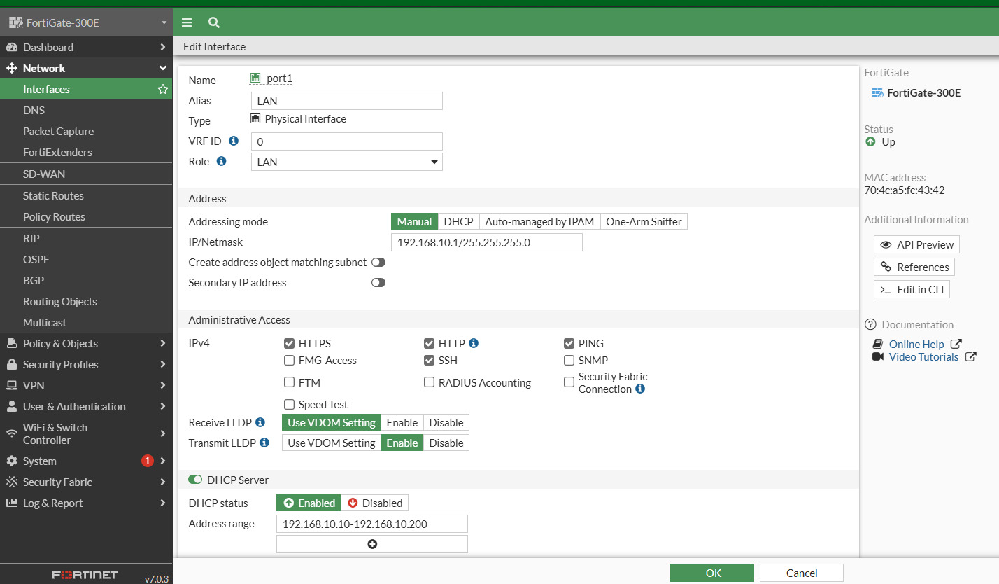
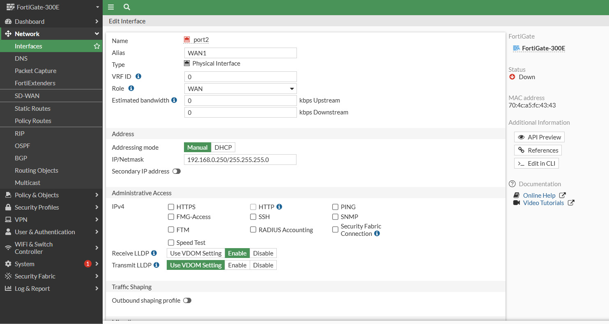
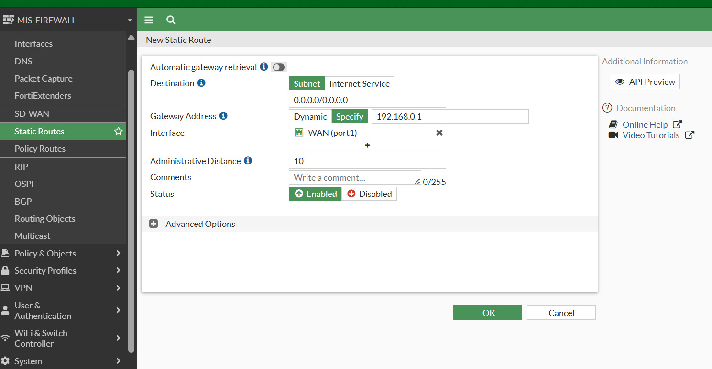
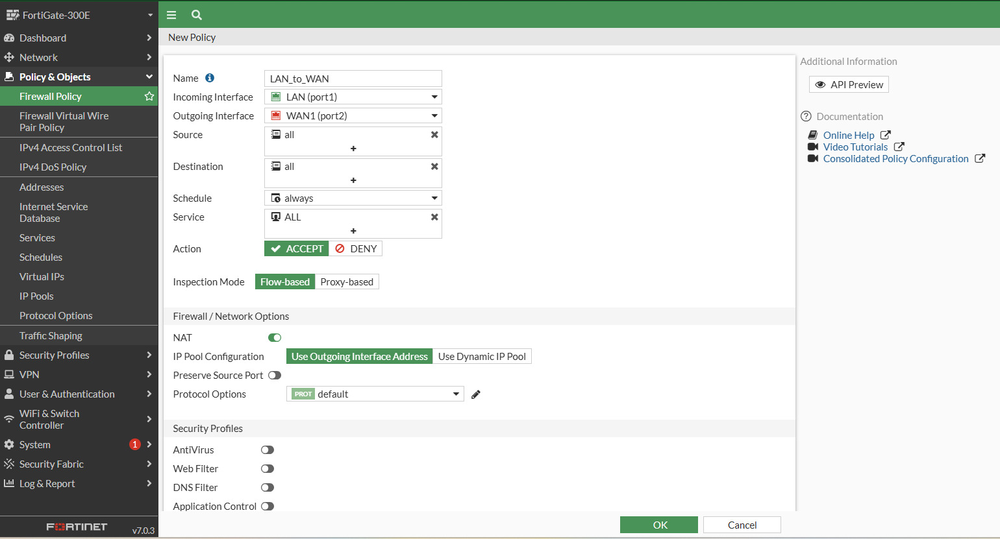
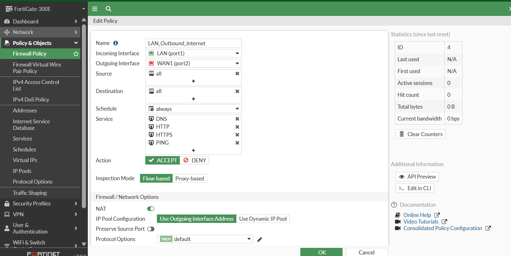

# FortiGate Basic Configuration

> **Device:** FortiGate 300E &nbsp;|&nbsp; **Guide 2 of 3** — FortiGate Configuration Series
> **Prepared by:** [Venkat Kannan](https://github.com/venkatkannan-infra)

Baseline setup for a FortiGate firewall acting as the edge device for a small/medium office network: LAN interface, WAN (ISP) interface, default route, and the primary outbound internet policy.

## Table of Contents

- [Step 1: Configure port1 (LAN)](#step-1-configure-port1-lan)
- [Step 2: Configure wan1 (ISP Connection)](#step-2-configure-wan1-isp-connection)
- [Step 3: Add the Default Static Route](#step-3-add-the-default-static-route)
- [Step 4: Create the Outbound Firewall Policy](#step-4-create-the-outbound-firewall-policy)
- [Essential Policy: Primary Outbound Internet Policy (SNAT)](#essential-policy-primary-outbound-internet-policy-snat)

---

## Step 1: Configure port1 (LAN)

1. In the left navigation bar, go to **Network > Interfaces**.
2. Find **port1** in the list and double-click it (or select it and click **Edit**).
3. Set the following details:

   | Field | Value |
   |---|---|
   | **Alias** | LAN |
   | **Role** | LAN |
   | **Addressing Mode** | Manual |
   | **IP/Netmask** | `192.168.10.1/255.255.255.0` (or `10.10.10.1/255.255.255.0`) |
   | **Administrative Access** | HTTPS, PING, SSH |

4. Under **DHCP Server**:

   | Field | Value |
   |---|---|
   | **Status** | Enable (toggle green) |
   | **Address Range** | Matches the interface subnet, e.g. `192.168.10.10 - 192.168.10.200` |
   | **Default Gateway** | Same as Interface IP |
   | **DNS Server** | Same as System DNS (or specify `8.8.8.8` / `1.1.1.1`) |

5. Click **OK** to save.

---

## Step 2: Configure wan1 (ISP Connection)

Configure **wan1** to connect to the ISP modem (in this example, the ISP modem uses the `192.168.0.x` range):

1. Under **Network > Interfaces**, double-click **wan1**.
2. Set **Role** to **WAN**.
3. Set **Addressing Mode** to **Manual** (or **DHCP** if the modem assigns IPs automatically).
   - If Manual, assign an IP on the ISP's subnet, e.g. `192.168.0.250/255.255.255.0`.
4. Under **DHCP Server**, leave it **Disabled** (red).
5. Click **OK**.

---

## Step 3: Add the Default Static Route

1. Go to **Network > Static Routes** and click **Create New**.
2. Set **Destination** to `0.0.0.0/0.0.0.0`.
3. Set **Gateway IP** to the ISP router's IP, e.g. `192.168.0.1`.
4. Set **Interface** to **wan1**.
5. Click **OK**.

---

## Step 4: Create the Outbound Firewall Policy

1. Go to **Policy & Objects > Firewall Policy** and click **Create New**.
2. Configure:

   | Field | Value |
   |---|---|
   | **Name** | `LAN_to_WAN` |
   | **Incoming Interface** | port1 |
   | **Outgoing Interface** | wan1 |
   | **Source** | all |
   | **Destination** | all |
   | **Schedule** | always |
   | **Service** | ALL |
   | **Action** | ACCEPT |

3. Ensure **NAT** is **ON**, with **Use Outgoing Interface Address** selected.
4. Click **OK**.

---

## Essential Policy: Primary Outbound Internet Policy (SNAT)

A common interview question: *"How do you allow internal LAN users to access the internet securely?"*

**Location:** Policy & Objects > Firewall Policy > Create New

| Field | Value |
|---|---|
| **Name** | `LAN_Outbound_Internet` |
| **Incoming Interface** | port1 (LAN) |
| **Outgoing Interface** | port2 (WAN) |
| **Source** | all (or a specific LAN subnet object) |
| **Destination** | all |
| **Schedule** | always |
| **Service** | HTTP, HTTPS, DNS, PING *(or ALL, depending on security requirements)* |
| **Action** | ACCEPT |
| **NAT** | ON — Use Outgoing Interface Address |

---

## Series Navigation

| Guide | Description |
|---|---|
| [1. Password Recovery](01-fortigate-password-recovery.md) | Maintainer-mode recovery via console cable |
| **2. Basic Configuration** *(this guide)* | Interfaces, routing, and the primary outbound policy |
| [3. Advanced Security Features](03-fortigate-advanced-security-features.md) | Web/DNS filtering, application control, IPS, VPN, DMZ |

---

**Author:** Venkat Kannan — IT Infrastructure & Systems Administrator
**GitHub:** [github.com/venkatkannan-infra](https://github.com/venkatkannan-infra)

*This guide is part of a hands-on FortiGate 300E lab documentation series, published as part of an ongoing infrastructure and security engineering portfolio.*
