# FortiGate Advanced Security Features

> **Device:** FortiGate 300E &nbsp;|&nbsp; **Guide 3 of 3** — FortiGate Configuration Series
> **Prepared by:** [Venkat Kannan](https://github.com/venkatkannan-infra)

Advanced security profiles and services layered on top of the [basic configuration](02-fortigate-basic-configuration.md): web filtering, port forwarding/VIP, DNS filtering, application control, IPS, IPsec remote-access VPN, and DMZ design.

## Table of Contents

- [1. Web Filtering Profile](#1-web-filtering-profile-blocking-categories--sites)
- [2. Port Forwarding / VIP (Inbound Access)](#2-port-forwarding--vip-inbound-access-to-internal-servers)
- [3. DNS Filter & Application Control](#3-dns-filter--application-control-vital-security-layers)
- [4. Intrusion Prevention System (IPS)](#4-intrusion-prevention-system-ips)
- [5. Remote Access IPsec VPN (FortiClient)](#5-remote-access-ipsec-vpn-forticlient)
- [6. DMZ Design](#6-dmz-design)

---

## 1. Web Filtering Profile (Blocking Categories & Sites)

Interviews frequently cover URL and category-based blocking (e.g., blocking social media or malicious domains).

### Step A: Create the Web Filter Profile

1. Go to **Security Profiles > Web Filter → Create New**.
2. **Name:** `Corporate_Web_Filter`
3. Under **FortiGuard Category Based Filter**:
   - Enable the toggle.
   - Expand categories such as **Social Networking** or **Potentially Liable** (e.g., Gambling/Pornography).
   - Right-click the category and select **Block**.

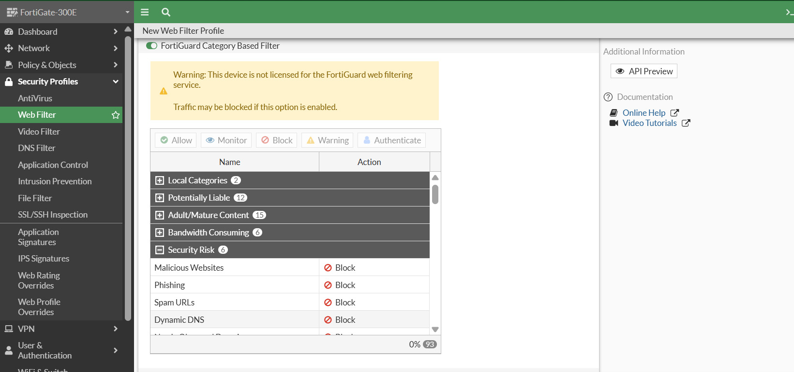

4. Under **Static URL Filter**:
   - Enable **URL Filter** and click **Create New**.
   - **URL:** `*facebook.com*`
   - **Type:** Wildcard or Regex
   - **Action:** Block
5. Click **Apply**.

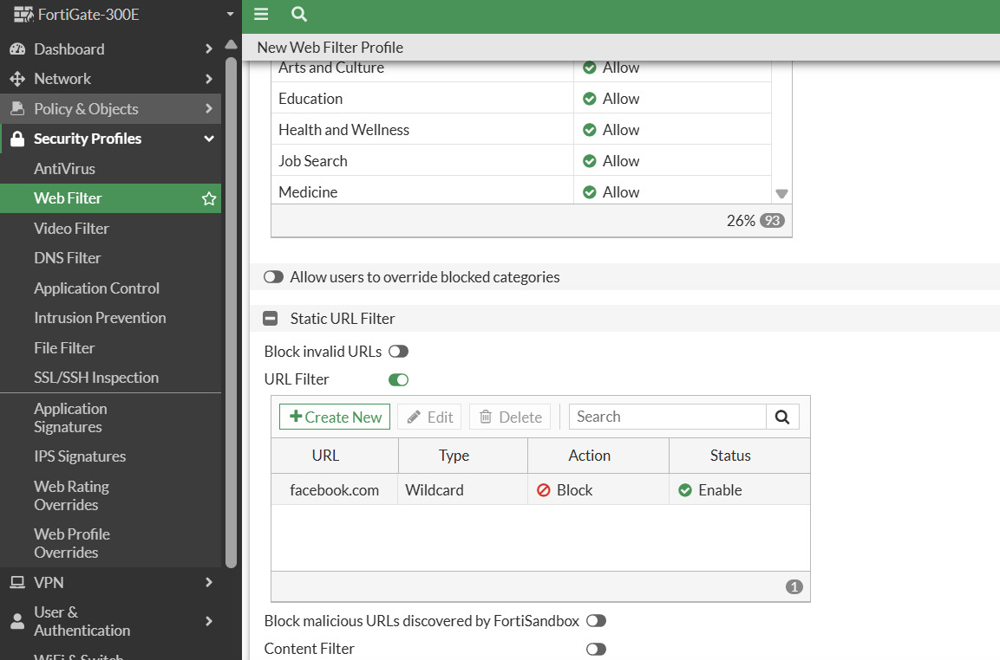

#### URL Filtering

URL Filter is also called Static URL Filter. It works by matching specific URLs against patterns containing text and regular expressions.

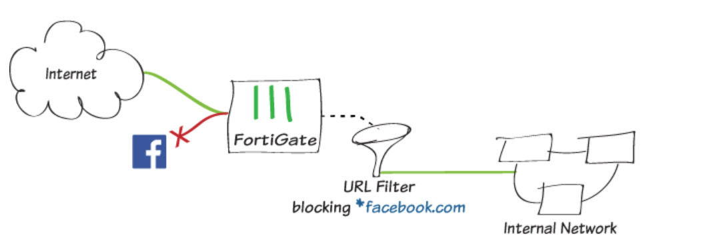

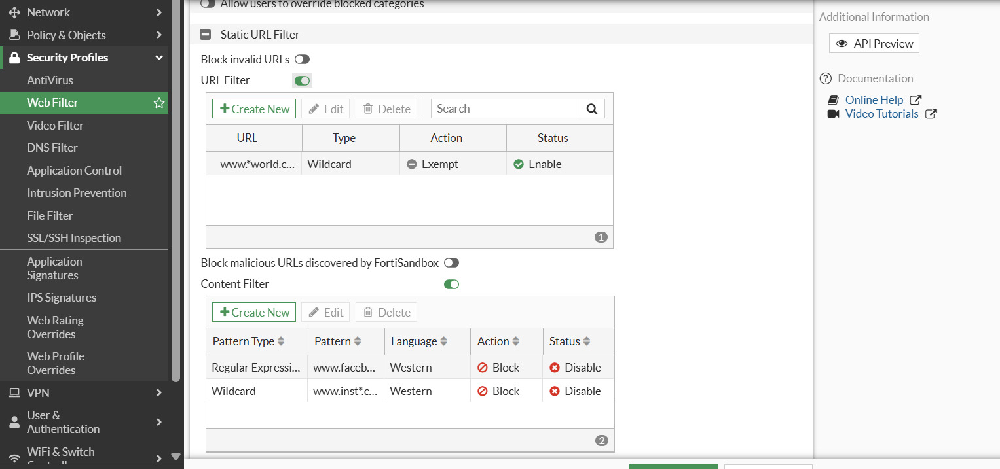

#### Web Content Filtering

Web Content Filtering controls access to web content by blocking pages that contain specific words or patterns — useful for preventing access to pages with questionable material.

- **Wildcard:** Uses `?` or `*` to represent one or more characters. For example, `forti*.com` matches both `fortinet.com` and `forticare.com` — `*` represents any character, repeated any number of times.
- **Regular Expression:** In regex mode, `*` represents *the character immediately before it*, repeated. For example, `forti*.com` matches `fortiii.com`, but **not** `fortinet.com` or `fortiice.com` — here `*` means "the letter `i`, repeated any number of times."

> The maximum number of web content filter patterns in a single list is **5,000**.

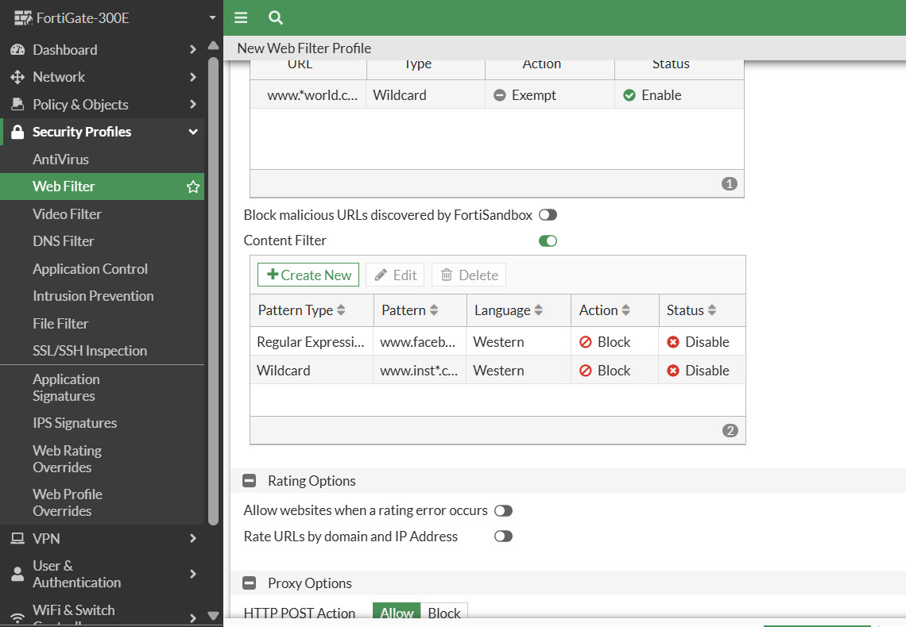

### Step B: Attach the Profile to a Policy

1. Go to **Policy & Objects > Firewall Policy**.
2. Edit the `LAN_Outbound_Internet` policy.
3. Under **Security Profiles**, toggle **Web Filter** to **ON** and select `Corporate_Web_Filter`.
4. Set **SSL Inspection** to `certificate-inspection` (or `deep-inspection` if full HTTPS inspection is configured).
5. Click **OK**.

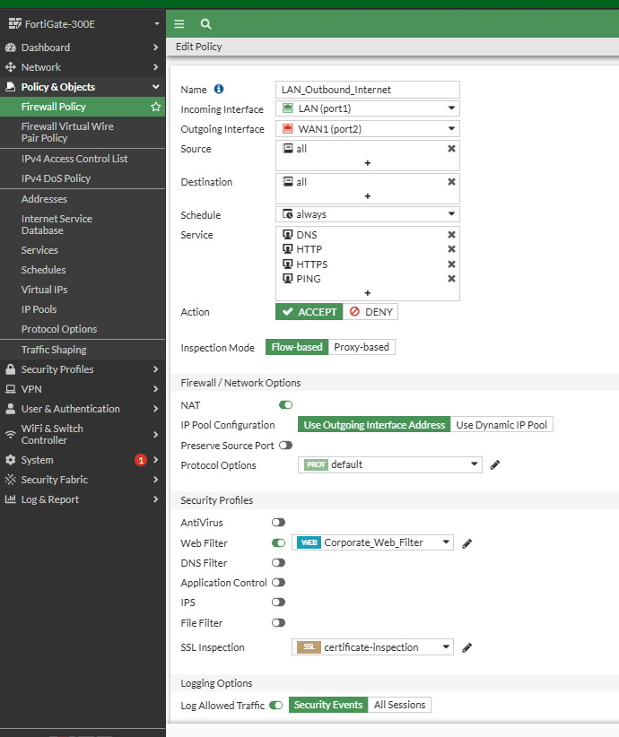

---

## 2. Port Forwarding / VIP (Inbound Access to Internal Servers)

A common interview question: *"How do you publish an internal web server or RDP server to the internet?"*

### Step A: Create a Virtual IP (VIP)

1. Go to **Policy & Objects > Virtual IPs > Create New > Virtual IP**.
2. **Name:** `VIP_WebServer`
3. **Interface:** port2 (WAN)
4. **External IP Address/Range:** `192.168.0.250` (WAN IP)
5. **Mapped IP Address/Range:** `192.168.10.50` (internal server's local IP)
6. Enable **Port Forwarding**:

   | Field | Value |
   |---|---|
   | **Protocol** | TCP |
   | **External Service Port** | 8080 |
   | **Map to Port** | 80 |

7. Click **OK**.

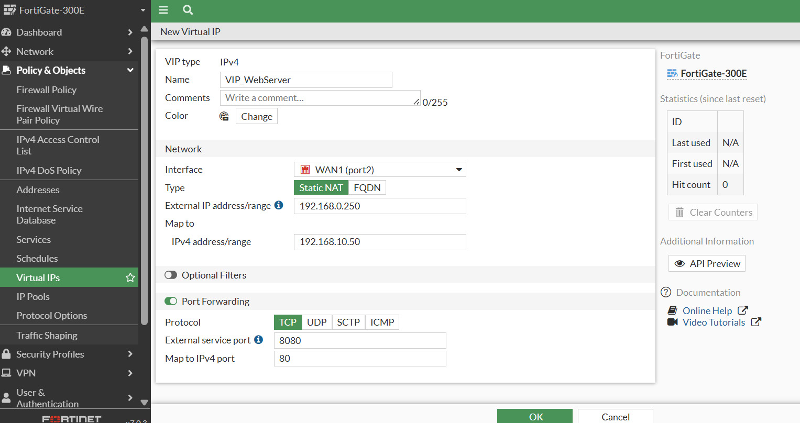

### Step B: Create the Inbound Firewall Policy

1. Go to **Policy & Objects > Firewall Policy → Create New**.
2. Configure:

   | Field | Value |
   |---|---|
   | **Name** | `Inbound_Web_Server` |
   | **Incoming Interface** | port2 (WAN) |
   | **Outgoing Interface** | port1 (LAN) |
   | **Source** | all |
   | **Destination** | `VIP_WebServer` address object |
   | **Service** | HTTP (or the specific forwarded port) |
   | **Action** | ACCEPT |
   | **NAT** | OFF *(destination translation is handled by the Virtual IP)* |

3. Click **OK**.

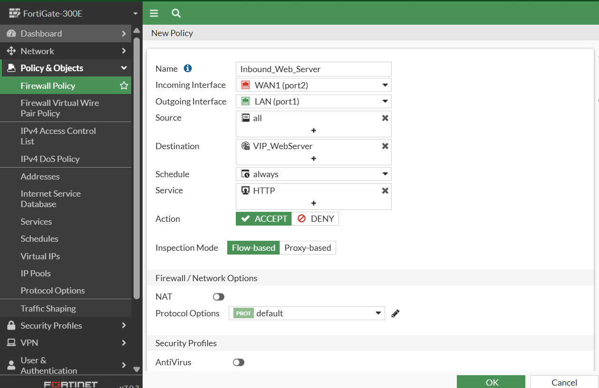

---

## 3. DNS Filter & Application Control (Vital Security Layers)

In technical interviews, candidate evaluation often hinges on understanding **Layer 7 Application Control** vs. **Layer 3/4 Firewall Rules**.

### DNS Filtering (Prevents Malware C2 Traffic)

1. Go to **Security Profiles > DNS Filter** and enable **Block Botnet C&C Servers**.
2. Attach it to the main outbound policy to block domain-level malware calls before a TCP connection even opens.

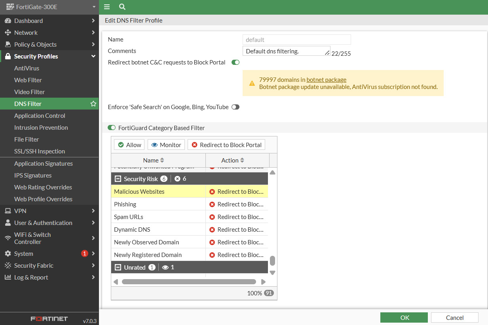

**How it works:** When enabled, if an infected internal endpoint attempts a DNS query for a known malware/botnet Command & Control domain, the FortiGate intercepts the request and redirects the traffic to a local block page instead of letting it reach the attacker.

> **On the license warning:** A message such as *"79,997 domains in botnet package... AntiVirus subscription not found"* simply means the Botnet database isn't being actively updated via a paid FortiGuard subscription. Even without an active license, the FortiGate still enforces protection using the **last downloaded local database** (79,997 known botnet domains in this example).

**Category-based blocking:** Under **Security Risk**, categories such as **Malicious Websites**, **Phishing**, and **Spam URLs** are also typically set to **Redirect to Block Portal**, giving full domain-level protection.

### Application Control (Blocks Apps Regardless of Port)

1. Go to **Security Profiles > Application Control**.
2. Create a profile that blocks **Peer-to-Peer (P2P)** tools (e.g., Torrent), **Proxy.Anonymizer** (VPN bypass tools), or specific apps like **Telegram**/**TikTok**.

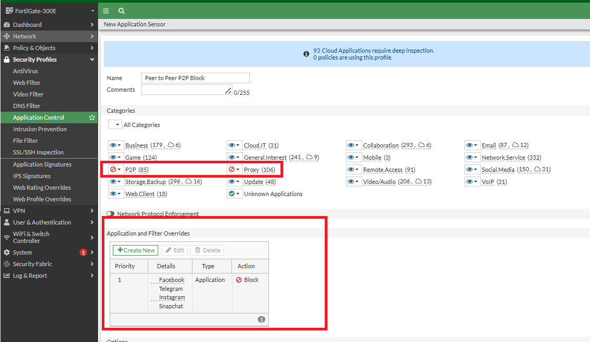

3. Attach the profile to the main outbound firewall policy.

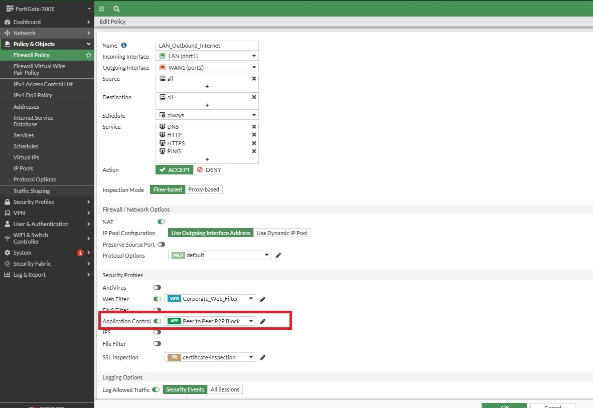

---

## 4. Intrusion Prevention System (IPS)

IPS on FortiGate works by scanning network packets at Layer 7 against a database of known exploit signatures and protocol anomalies (buffer overflows, SQL injections, remote code execution attempts, etc.).

### Step 1: Create the IPS Profile

1. Go to **Security Profiles > Intrusion Prevention**.
2. Click **+ Create New**.
3. Name the profile, e.g. `Corporate_IPS_Profile`.

### Step 2: Add IPS Filters or Signatures

Threats can be blocked using either:

- **IPS Filters** — broad rules matching categories/severities, or
- **IPS Signatures** — specific CVE exploits.

- **Signature mapping:** Vendor signature databases map individual IPS rules to specific CVE identifiers (e.g., `CVE-2021-26855`).
- **Wildcard/range matching:** Filters can target a specific year (e.g., `CVE-2023-*`) or an exact string match.

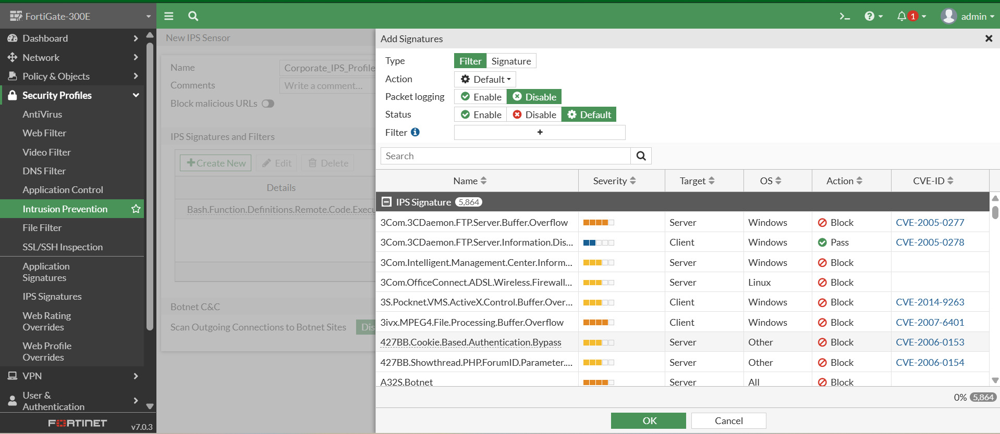

#### Option A: Add an IPS Filter (recommended for general protection)

1. Under **IPS Filters**, click **+ Add Filter**.
2. Set the filter criteria:

   | Field | Value |
   |---|---|
   | **Target** | Server or Client (depending on what's being protected) |
   | **Severity** | Critical, High, Medium |
   | **Action** | Block |

3. Click **OK**.

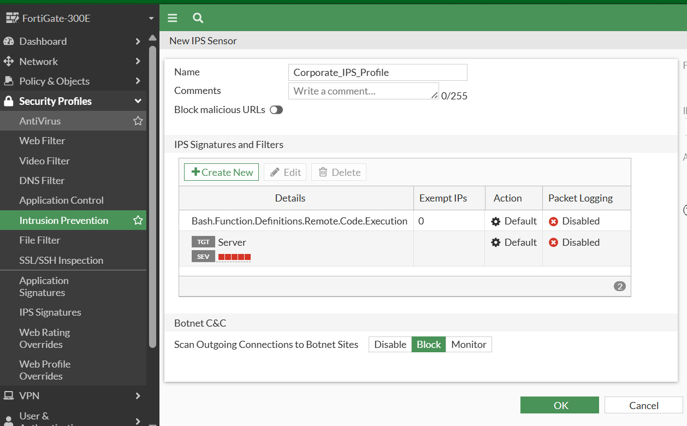

### Step 3: Attach the IPS Profile to a Firewall Policy

An IPS profile does not inspect any traffic until it is attached to an active firewall policy.

1. Go to **Policy & Objects > Firewall Policy**.
2. Edit the target policy (e.g., `LAN_to_WAN` outbound, or an inbound server policy).
3. Scroll to **Security Profiles**.
4. Toggle **Intrusion Prevention** to **ON** and select `Corporate_IPS_Profile`.
5. Set **SSL Inspection** to `deep-inspection` (or `certificate-inspection`).

   > **Interview note:** IPS needs to inspect packet payloads. If traffic is encrypted over HTTPS (port 443), **Deep SSL Inspection** is required so the FortiGate can decrypt the packet and run IPS signatures against the payload.

6. Click **OK**.

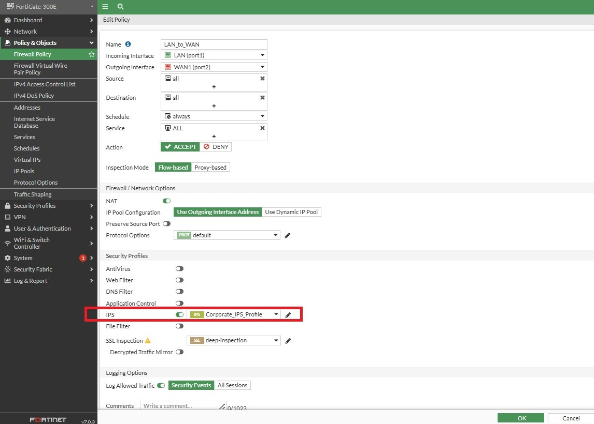

---

## 5. Remote Access IPsec VPN (FortiClient)

### Step 1: Run the VPN Setup Wizard

1. Go to **VPN > IPsec Wizard**.
2. **Name:** `Remote_Access_VPN`
3. **Template Type:** Remote Access
4. **Remote Device Type:** FortiClient
5. Click **Next**.

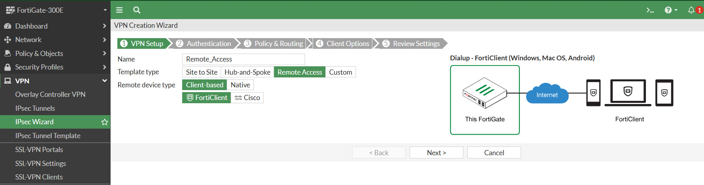

### Step 2: Configure Network & Authentication

1. **Incoming Interface:** port2 (WAN)
2. **Authentication Method:** Pre-Shared Key — enter a strong secret (e.g., `MySecretVpnKey123!`)
3. **User Group:** click **+** to create or select a user group (e.g., `VPN_Users`)
4. Click **Next**.

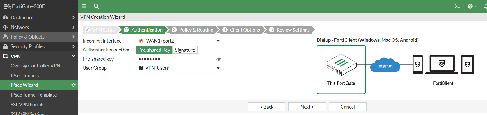

### Step 3: Define Client IP Range & Routing

- Click **+** and select **port1** (LAN interface).
- Click **+** and select **all** (or the local subnet object, e.g. `192.168.10.0/24`).

| Field | Value |
|---|---|
| **Client Address Range** | `10.200.200.1 - 10.200.200.50` |
| **Subnet Mask** | `255.255.255.0` |
| **DNS Server** | Use System DNS (or Specify: `8.8.8.8`) |
| **Enable IPv4 Split Tunnel** | Enabled (green) |

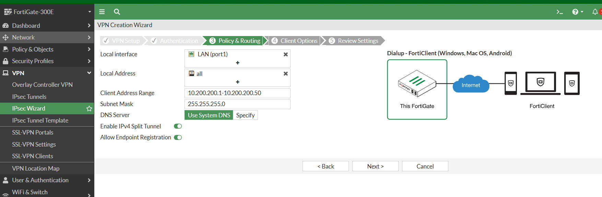

> **Split tunneling:** Corporate-bound traffic is sent through the encrypted VPN tunnel, while standard internet traffic goes through the user's local connection. Enabling it saves corporate bandwidth and prevents general web traffic from overloading the firewall.

### FortiClient Behavior Settings

These options control how the FortiClient app behaves on end-user laptops:

| Setting | Recommended | Notes |
|---|---|---|
| **Save Password** | ON | Allows users to save their VPN password so they don't re-enter it every time. |
| **Auto Connect** | OFF | Enable only if the VPN should start automatically on Windows login. |
| **Always Up (Keep Alive)** | OFF | Enable only for corporate-managed devices that must stay persistently connected to the office network. |

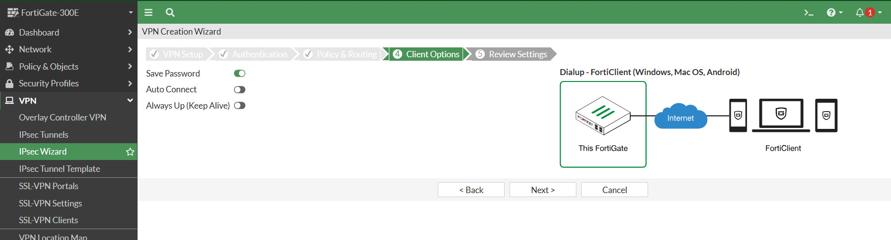

### Finish the Setup

1. Click **Next**.
2. **Step 5 (Review Settings)** displays a summary of everything the wizard created (IPsec tunnels, firewall policies, and address objects).
3. Click **Create** (or **Finish**).

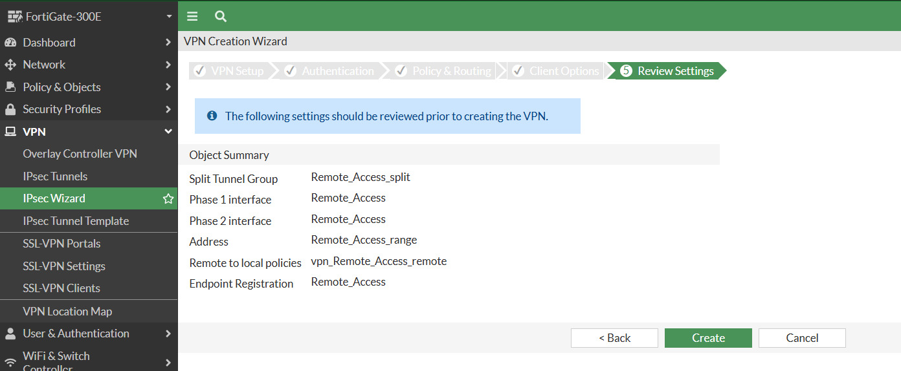

### Verify the Firewall Policy

Go to **Policy & Objects > Firewall Policy**. A newly auto-generated policy (e.g., `Remote_Access_VPN_to_LAN`) should appear, allowing traffic from the IPsec interface to port1 (LAN).

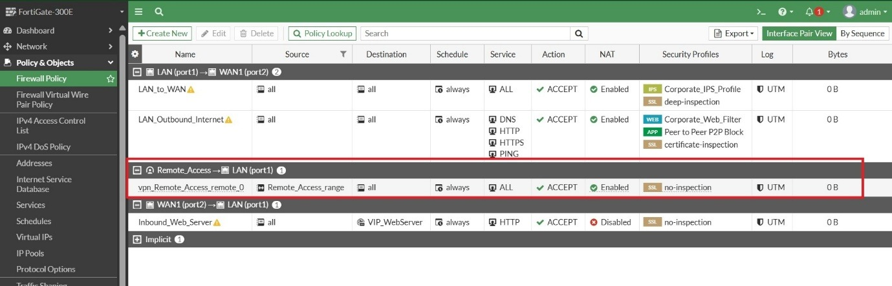

---

## 6. DMZ Design

### Step 1: Configure a DMZ Interface

1. Go to **Network > Interfaces**.
2. Select an unused port (e.g., **port3**) and click **Edit**.
3. Set the following:

   | Field | Value |
   |---|---|
   | **Alias** | DMZ |
   | **Role** | DMZ *(automatically applies FortiGate's recommended DMZ security templates)* |
   | **Addressing Mode** | Manual |
   | **IP/Netmask** | A dedicated subnet, e.g. `172.16.10.1/255.255.255.0` |
   | **Administrative Access** | PING, HTTPS *(only if local management is needed)* |

4. Click **OK**.

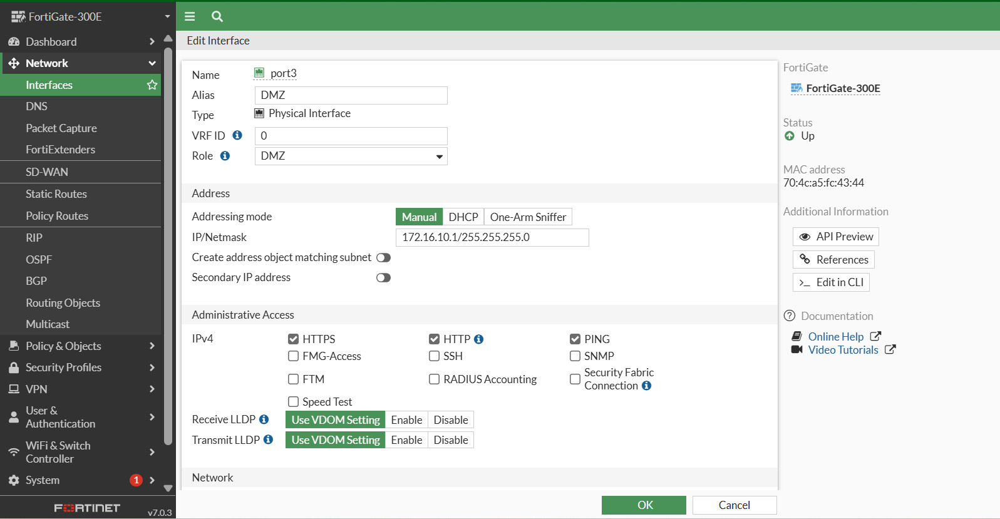

### Step 2: Required Firewall Policies for a DMZ

In a standard enterprise setup, three separate policy rules are created:

1. **WAN → DMZ (Inbound Traffic)**

   | Field | Value |
   |---|---|
   | **Incoming** | wan1 (port2) |
   | **Outgoing** | dmz (port3) |
   | **Destination** | Virtual IP (VIP) pointing to the DMZ server |
   | **Action** | ACCEPT — limited to specific services (HTTP/HTTPS) |
   | **NAT** | OFF *(handled by the Virtual IP)* |

   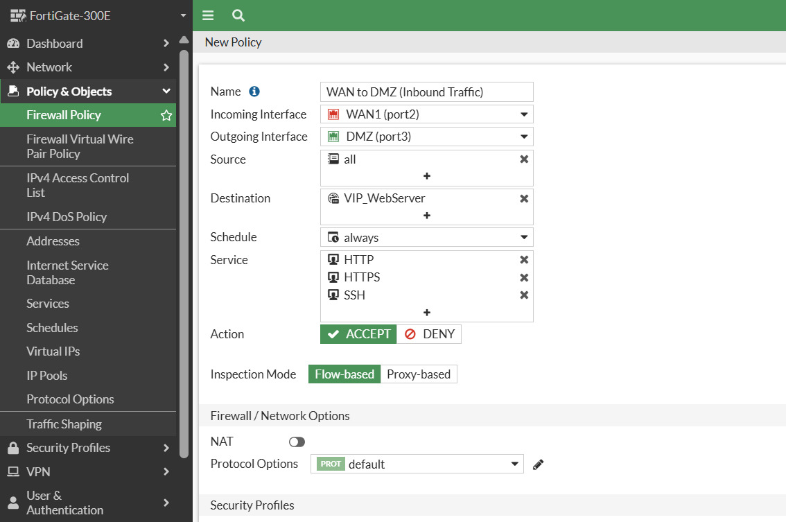

2. **LAN → DMZ (Internal Admin Access)**

   | Field | Value |
   |---|---|
   | **Incoming** | port1 (LAN) |
   | **Outgoing** | dmz (port3) |
   | **Action** | ACCEPT — allows internal staff to manage the server via SSH/RDP |

   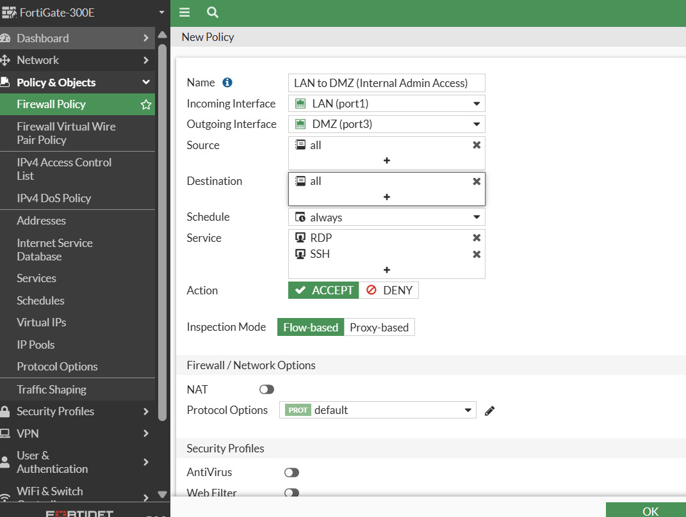

3. **DMZ → LAN (Blocked / Strongly Restricted)**

   - **Rule:** No policy is created (or an explicit **DENY** policy is set).
   - **Why:** If the DMZ server is compromised, it must not be able to initiate connections back into the internal LAN.

---

## Series Navigation

| Guide | Description |
|---|---|
| [1. Password Recovery](01-fortigate-password-recovery.md) | Maintainer-mode recovery via console cable |
| [2. Basic Configuration](02-fortigate-basic-configuration.md) | Interfaces, routing, and the primary outbound policy |
| **3. Advanced Security Features** *(this guide)* | Web/DNS filtering, application control, IPS, VPN, DMZ |

---

**Author:** Venkat Kannan — IT Infrastructure & Systems Administrator
**GitHub:** [github.com/venkatkannan-infra](https://github.com/venkatkannan-infra)

*This guide is part of a hands-on FortiGate 300E lab documentation series, published as part of an ongoing infrastructure and security engineering portfolio.*
